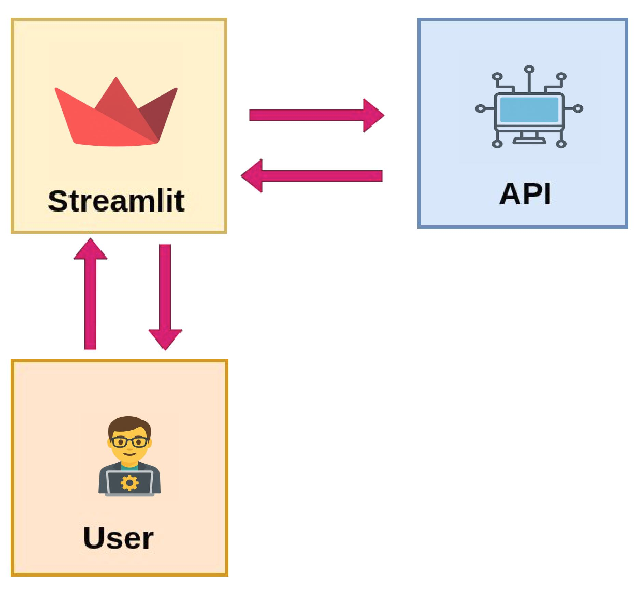

# **Phase 2 : Data Analyst - Exploration et Visualisation**  



## Introduction

**Objectif : Exploration et analyse des données en interrogeant l’API.**  

🔹 **Analyse Exploratoire des Données (EDA)** :  
- Utilisation du **SDK Python** pour requêter l’API et récupérer les données.  
- Identification des tendances dans les notes des films.  
- Étude des genres les plus populaires et les préférences des utilisateurs.  

🔹 **Construction d’une Data App avec Streamlit** :  
- Création d'une **application interactive** qui permet de visualiser les tendances du cinéma.  
- Intégration des **tableaux dynamiques** et des **graphiques interactifs**.  
- **Recherche avancée** des films en fonction des notes et des genres.  

**Livrables** :  
- Un notebook d'analyse exploratoire interactif.  
- Une **application web Streamlit** connectée à l’API qui présente, de manière interactive, les insights aux parties prenantes.

---

## Présentation de Jupyter Notebook

**Jupyter Notebook** est un environnement interactif très populaire dans le monde de la **Data Science**. Il permet d’écrire du code Python, de visualiser des graphiques, d’insérer des textes explicatifs (en Markdown), et de documenter une analyse de données de manière fluide et lisible.

---

### Pourquoi Jupyter Notebook est si populaire ?

🔹 **Interactivité totale** : Chaque cellule de code peut être exécutée indépendamment, ce qui permet d’explorer les données pas à pas.

🔹 **Documentation intégrée** : On peut facilement alterner entre du code Python et des explications en langage naturel (Markdown), ce qui en fait un excellent outil pédagogique et professionnel.

🔹 **Visualisation immédiate** : Les bibliothèques comme `matplotlib`, `seaborn` ou `plotly` s’intègrent parfaitement à Jupyter pour créer des visualisations dynamiques.

🔹 **Support riche** : Intègre du HTML, des tableaux interactifs, des widgets, etc. Parfait pour présenter un projet à un client ou à une équipe.

---

### Un outil central pour le Data Analyst

Durant la phase 2, j'ai utilisé Jupyter Notebook pour :

- Charger et explorer les données extraites via votre SDK (et donc indirectement via l’API).
- Réaliser une **analyse exploratoire** complète : tendances, corrélations, genres populaires...
- Visualiser les résultats sous forme de **graphiques** compréhensibles et exploitables.
- Créer un **notebook professionnel** que vous pourrez intégrer dans votre portfolio.

---


---

## Mise en place de l’environnement d’analyse

Dans ce projet, j'ai utilisé **VSCode** comme éditeur principal et organisons chaque phase dans un répertoire Git dédié. Pour cette phase 2 (*Data Analyst – Exploration & Visualisation*), tu vas travailler dans un nouveau projet nommé par exemple `movielens-analytics` 

Voici les étapes pour bien démarrer :

### 1. Cloner le dépôt GitHub du projet

J'ai cloner  le dépôt GitHub du projet dont le lien est:
```bash
githttps://github.com/Alimiji/FILMNS_ANALYTICS

cd FILMNS_ANALYTICS
```

### 2. Création et activation d'un environnement virtuel

Ensuite, j'ai configuré un environnement Python isolé pour gérer les dépendances :

```bash
python3 -m venv .venv
source .venv/bin/activate
```

> Sur windows on peut utiliser:  
> `.\.venv\Scripts\activate`

### 3. Ouvrir le projet dans VSCode

```bash
code .
```

v`.

### 4. Création du notebook pour l'abalyse des données

 

```bash

touch  movie_data_analysis.ipynb
```

### 5. Installation du SDK `alimiji_film_sdk`

Ce SDK te permettra d’interagir avec l’API MovieLens. Installe-le dans ton environnement :

```bash
pip install alimiji_film_sdk
```

### 6. Lancement et configuration du Jupyter Notebook


---

**L' environnement est prêt !**

J'effectue **l' analyse exploratoire interactive** directement dans le fichier `movie_data_analysis.ipynb`.  
J'effectue ensuite l'exploration des films, des notes, des genres... et la visualisation tout ça avec des graphiques dynamiques !

---

## Familiarisation avec l'API dans un notebook 

Voir Fichier `movie_data_analysis.ipynb` 

## Visualisation des données

Voir Fichier `movie_dataviz.ipynb` 

## Intégration de l'API dans une application Streamlit

Streamlit est une bibliothèque open-source en Python qui permet de créer des applications web interactives pour la visualisation de données et le machine learning de manière rapide et simple. Il est particulièrement populaire auprès des Data Scientists, des ingénieurs et des chercheurs qui souhaitent partager leurs analyses et modèles sans avoir à développer des interfaces web complexes.

Avec Streamlit, il suffit de quelques lignes de code pour créer des applications avec des éléments interactifs comme des graphiques, des tables, des cartes, des curseurs, des boutons, etc. Le principal avantage de Streamlit est sa facilité d'utilisation : il transforme un script Python classique en une application web sans avoir besoin de connaître HTML, CSS ou JavaScript.

Voici quelques caractéristiques principales de Streamlit :
- **Simplicité** : Écrire une application Streamlit se fait généralement en quelques lignes de code.
- **Interactivité** : Il permet d'ajouter facilement des widgets interactifs (curseurs, boîtes de sélection, champs de texte, etc.).
- **Intégration facile avec des bibliothèques Python** : Il supporte des bibliothèques populaires telles que Matplotlib, Plotly, Pandas, et bien d’autres.
- **Mise à jour dynamique** : Les modifications apportées au code sont immédiatement visibles sans avoir à recharger la page.

C'est donc un outil idéal pour prototyper des applications de data science rapidement et les déployer de manière simple.

Pour utiliser *streamlit*, vous devez préalablement l'installer :

```bash
pip install streamlit
```

Mon application Streamlit comprend donc un fichier de point d'entrée, le fichier que Streamlit chargera en premier. Dans cette application, nous utiliserons ce fichier pour définir la configuration initiale et créer la navigation entre les pages/menus de l'application.

Exécutez ces commandes à partir du répertoire racine de votre projet :

```bash
cd FILMNS_ANALYTICS
mkdir streamlit_app
cd streamlit_app
touch movielens_app.py
touch page1.py
touch page2.py
touch page3.py
```

Codes complet de l'application : voir dossier `FILMNS_ANALYTICS/streamlit_app`

---

Pour afficher le lien direct vers la page IMDb d'un film ainsi aue son image d'affiche, j'ai créé la clé API OMDb en suivant les 3 étapes suivantes:

1. Accès à la page: [http://www.omdbapi.com/apikey.aspx](http://www.omdbapi.com/apikey.aspx)
2. Demande de **clé gratuite (Personal Use Only)**
3. Réception d'un mail avec un lien comme :  
   `http://img.omdbapi.com/?i=tt0111161&apikey=VOTRE_CLE`

On peut donc créer une URL `poster_url` très facilement à partir de l’ID IMDb.

---

Le fichier `get_movie_poster.py` permet de générer le fichier "output/links_enriched.parquet" contenant pour chaque film son lien vers sa page IMDb ainsi que le lien de son image d'affiche.
